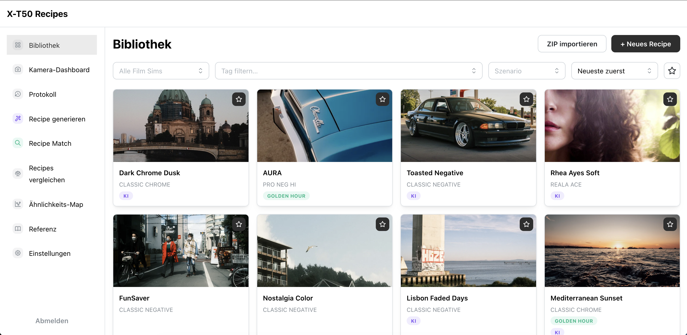
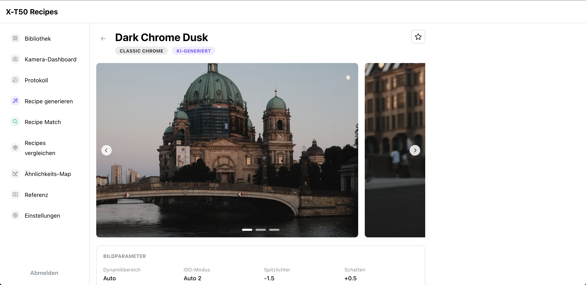
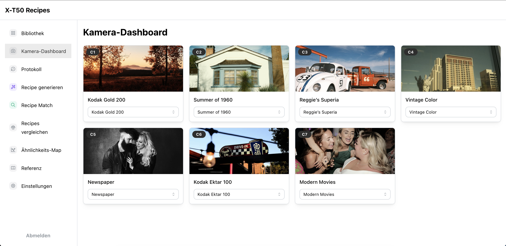
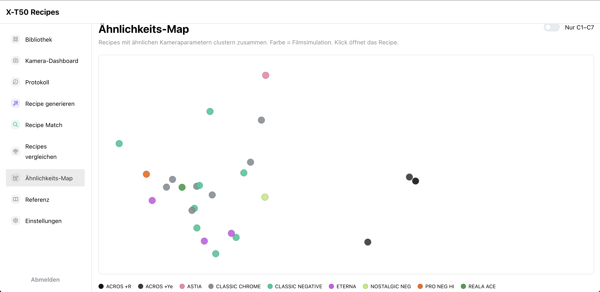
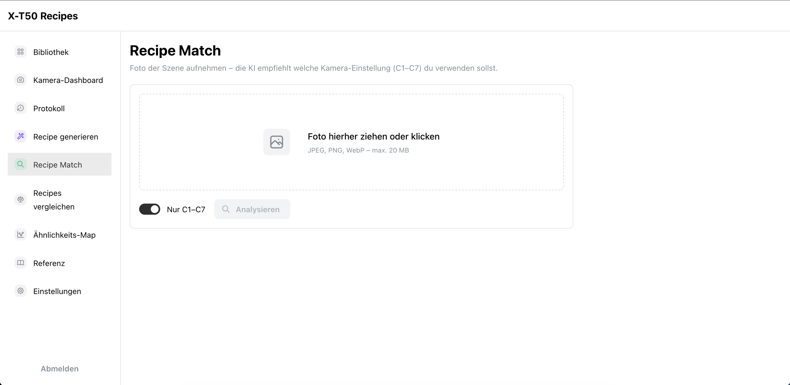

# X-T50 Recipes

[](https://github.com/Sven-Lyco/X-T50-Recipes/actions/workflows/ci.yml)

Persönliche Web-App zur Verwaltung von Fujifilm X-T50 Film-Simulation-Recipes. Recipes enthalten alle JPEG-Kameraeinstellungen, Beispielbilder, Beschreibungen und Tags. Ein Dashboard zeigt, welches Recipe auf welcher Custom-Bank (C1–C7) der Kamera aktiv ist.

## Screenshots

<table>
  <tr>
    <td align="center"><br/><em>Bibliothek</em></td>
    <td align="center"><br/><em>Detailansicht</em></td>
  </tr>
  <tr>
    <td align="center"><br/><em>Kamera-Dashboard</em></td>
    <td align="center"><br/><em>Ähnlichkeits-Map</em></td>
  </tr>
  <tr>
    <td colspan="2" align="center"><br/><em>Recipe Match</em></td>
  </tr>
</table>

## Features

- **Bibliothek** – Kartenraster aller Recipes, filterbar nach Filmsimulation, Tags, Shooting-Szenario und Favoriten
- **Detailansicht** – alle Parameter in Sektionen, Bildergalerie, PDF-Export, A6-Karten-Export, ZIP-Export, PNG-Export (für fujirecipes.co Screenshot-Import), Duplizieren
- **Duplikat-Warnung** – beim Speichern (Neu anlegen & Bearbeiten) wird automatisch auf ähnliche Recipes geprüft (≥ 85 % Ähnlichkeit); Modal mit Links und Score, kein hartes Blockieren
- **Kamera-Dashboard** – C1–C7-Slots mit Direktzuweisung
- **Slot-Protokoll** – Verlauf aller C1–C7-Slot-Änderungen; zeigt pro Slot ob er häufig wechselt (aktiv) oder seit Langem konstant belegt ist (stabil)
- **Vergleichen** – bis zu 4 Recipes Side-by-Side mit Unterschieds-Highlighting und Ähnlichkeits-Score
- **Ähnlichkeits-Map** – alle Recipes als interaktive 2D-Karte (MDS), ähnliche Recipes clustern zusammen; optional nur C1–C7
- **KI-Generierung** – Referenzfoto(s) hochladen → Claude Vision schlägt passende Einstellungen vor (inkl. EXIF-Kontext)
- **Recipe Match** – Foto hochladen → KI empfiehlt, welcher C1–C7-Slot am besten zu Motiv/Licht passt (optional auf alle Recipes erweiterbar)
- **Parameter-Referenz** – Nachschlagewerk zu allen Filmsimulationen und Bildparametern mit Kamera-Menü-Beschreibungen
- **Einstellungen** – Backup aller Recipes als ZIP exportieren/importieren; KI-Funktionen global an-/ausschalten; Standard-KI-Modell wählen
- **PWA** – installierbar auf iOS/iPadOS über den Home-Screen

## Tech-Stack

| Schicht | Technologie |
|---|---|
| Backend | Java 21, Spring Boot 3, Spring Data JPA, Spring Security + JWT |
| Datenbank | PostgreSQL, Flyway-Migrationen |
| Frontend | React, TypeScript, Vite, Mantine UI, React Query |
| KI | Anthropic Claude Vision API (Haiku / Sonnet / Opus) |
| Deployment | Docker (Multi-Stage), Coolify, Hetzner |

## Projektstruktur

```text
X-T50-Recipes/
├── src/main/java/de/fuji/xt50recipes/
│   ├── auth/          JWT, Security, Rate Limiting
│   ├── recipe/        CRUD, Camera Slots, Export/Import
│   ├── image/         Upload, Storage, Reorder
│   ├── ai/            KI-Generierung, Recipe Match, ImageUtils
│   ├── user/          AppUser Entity
│   └── config/        Security, SPA-Fallback, Image-Serving
├── src/main/resources/
│   ├── db/migration/  Flyway-Migrationen (V1–V9)
│   └── application.yml
├── frontend/          React + TypeScript + Vite
│   └── src/
│       ├── pages/     Screens (Library, Detail, Form, Camera, Compare, Map, Match, Generate, Reference, Protocol, Settings)
│       ├── contexts/  SettingsContext (localStorage-backed App-Einstellungen)
│       ├── api/       React Query Hooks + Axios Client
│       ├── utils/     Similarity-Score, MDS-Algorithmus, Labels
│       └── components/ PDF-Renderer
├── docs/architecture/ arc42-Architekturdokumentation
├── Dockerfile         Multi-Stage Build (Node → Gradle → JRE)
└── docker-compose.yml Lokale Entwicklung + Produktiv-Setup
```

## Architekturdokumentation

Die vollständige arc42-Dokumentation liegt unter [`docs/architecture/`](docs/architecture/):

| Dokument | Inhalt |
|---|---|
| [01 — Einführung & Ziele](docs/architecture/01-introduction-goals.md) | Motivation, Ziele, Qualitätsanforderungen |
| [02 — Randbedingungen](docs/architecture/02-constraints.md) | Technische und organisatorische Constraints |
| [03 — Systemkontext](docs/architecture/03-context-scope.md) | Systemgrenzen, externe Schnittstellen |
| [04 — Lösungsstrategie](docs/architecture/04-solution-strategy.md) | Zentrale Architekturentscheidungen im Überblick |
| [05 — Bausteinsicht](docs/architecture/05-building-block-view.md) | Backend-Packages, Frontend-Struktur, alle Klassen |
| [06 — Laufzeitsicht](docs/architecture/06-runtime-view.md) | Login, KI-Generierung, Recipe Match, Slot-Zuweisung, MDS-Map |
| [07 — Verteilungssicht](docs/architecture/07-deployment-view.md) | Docker-Build, Coolify, Volumes, Env-Vars |
| [08 — Querschnittliche Konzepte](docs/architecture/08-crosscutting-concepts.md) | Auth, Bild-Handling, Migrationen, KI-Integration, Ähnlichkeits-Algo |
| [09 — Architekturentscheidungen](docs/architecture/09-decisions/) | 7 ADRs (Spring Boot, Mantine, JWT, Storage, MDS, Claude, Deployment) |
| [10 — Qualitätsanforderungen](docs/architecture/10-quality-requirements.md) | Qualitätsszenarien und Zielwerte |
| [11 — Risiken & Tech-Debt](docs/architecture/11-risks-technical-debt.md) | Bekannte Risiken und offene Schulden |
| [12 — Glossar](docs/architecture/12-glossary.md) | Domänen- und Technikbegriffe |

## Lokale Entwicklung

### Voraussetzungen

- Java 21
- Node.js 20+
- Docker (für PostgreSQL)

### Setup

```bash
# PostgreSQL starten
docker compose up db -d

# Backend starten (Port 8080)
./gradlew bootRun

# Frontend starten (Port 5173, mit Proxy auf Backend)
cd frontend
npm install
npm run dev
```

Die App ist dann unter `http://localhost:5173` erreichbar.

Alternativ alles per Docker starten (entspricht dem Produktiv-Setup):

```bash
cp docker-compose.override.yml.example docker-compose.override.yml
docker compose up --build -d
```

Die App ist dann unter `http://localhost:8080` erreichbar.

> `docker-compose.override.yml` ist gitignored (nur lokal). Die `.example`-Datei dient als Vorlage und muss einmalig kopiert werden.

### Erster Login

Der initiale Admin-User wird per Flyway-Migration angelegt. Zugangsdaten über die Env-Vars `APP_ADMIN_USERNAME` / `APP_ADMIN_PASSWORD` konfigurierbar (Default: `admin` / kein Passwort gesetzt → muss gesetzt sein).

### Tests

```bash
# Backend
./gradlew test

# Frontend
cd frontend
npm test
```

GitHub Actions (`.github/workflows/ci.yml`) führt bei jedem Push auf `main` und bei Pull Requests `test-backend` und `test-frontend` parallel aus; Testergebnisse erscheinen als GitHub-native Check-Run-Annotationen (`dorny/test-reporter`).

## Umgebungsvariablen

| Variable | Pflicht | Beschreibung |
|---|---|---|
| `DB_URL` | Ja | JDBC-URL, z.B. `jdbc:postgresql://db:5432/xt50recipes` |
| `DB_USERNAME` | Ja | Datenbankbenutzer |
| `DB_PASSWORD` | Ja | Datenbankpasswort |
| `JWT_SECRET` | Ja | Mindestens 32 Zeichen, zufällig generieren |
| `APP_ADMIN_USERNAME` | Nein | Login-Username (Default: `admin`) |
| `APP_ADMIN_PASSWORD` | Ja | Login-Passwort (bcrypt wird intern erzeugt) |
| `IMAGE_STORAGE_PATH` | Nein | Pfad für Bild-Uploads (Default: `./images`) |
| `ANTHROPIC_API_KEY` | Nein | Für KI-Features (ohne Key sind Recipe-Generierung und Recipe Match deaktiviert) |
| `JWT_EXPIRATION_MS` | Nein | Token-Gültigkeit in ms (Default: 86400000 = 24h) |

## Deployment (Coolify)

Das Projekt nutzt ein Multi-Stage Dockerfile: Das React-Build wird nach `src/main/resources/static` kopiert, Spring Boot liefert Frontend und API aus einem einzigen Image aus.

In Coolify:
1. **App-Service** aus diesem Repo aufbauen
2. **PostgreSQL-Service** hinzufügen, Credentials via Env-Vars verbinden
3. **Volume** für Bild-Uploads mounten auf `/app/images`
4. Alle Pflicht-Env-Vars als Secrets eintragen
5. `ANTHROPIC_API_KEY` optional für KI-Features

`docker-compose.yml` enthält bereits die Traefik-Buffering-Middleware für große Bild-Uploads (Labels am `app`-Service) – dafür ist keine manuelle Konfiguration in Coolifys UI nötig, siehe [07-deployment-view.md](docs/architecture/07-deployment-view.md#traefik-buffering-für-große-uploads).

## KI-Features

### Recipe generieren

Unter „Recipe generieren" können bis zu 5 Referenzfotos (JPEG, PNG, WebP) hochgeladen werden. Claude Vision analysiert den Look und befüllt das Recipe-Formular vor – inklusive Name und Begründung auf Deutsch. EXIF-Metadaten (ISO, Belichtungszeit, Blende) werden automatisch extrahiert und als zusätzlicher Kontext mitgeschickt. Das Ergebnis kann vor dem Speichern frei angepasst werden.

KI-generierte Recipes erhalten ein violettes „KI-Generiert"-Badge.

### Recipe Match

Unter „Recipe Match" ein Foto der Szene hochladen, die fotografiert werden soll. Die KI analysiert Lichtstimmung, Motiv und Atmosphäre und empfiehlt, welche der belegten C1–C7-Einstellungen am besten zu dieser Situation passt – mit kurzer Begründung pro Empfehlung. Standardmäßig wird auf C1–C7 eingeschränkt, optional kann auch die gesamte Bibliothek durchsucht werden.

Das Standard-Modell wird zentral in den Einstellungen (`/settings`) konfiguriert:

- **Haiku 4.5** – schnell und günstig
- **Sonnet 4.6** – bessere Bildanalyse (empfohlen)
- **Opus 4.8** – stärkstes Modell
